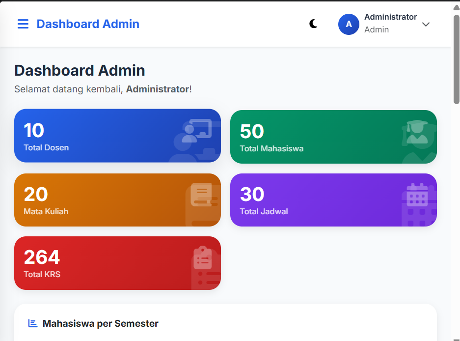
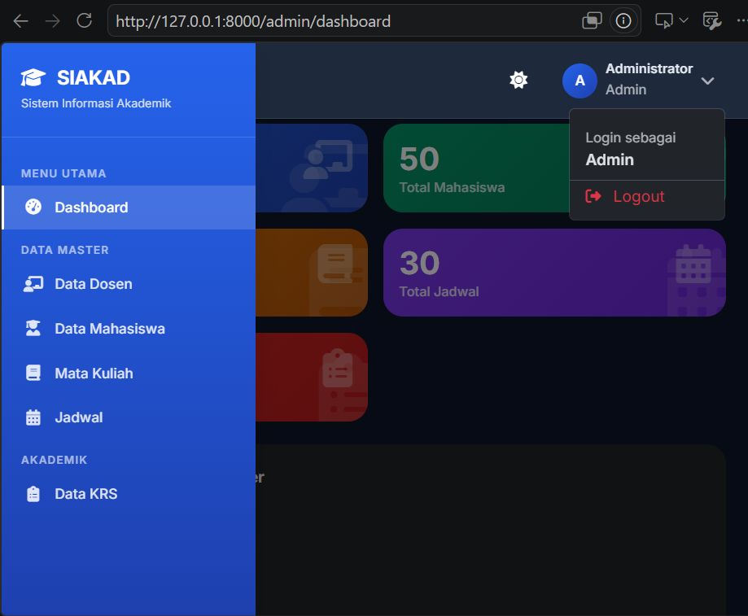
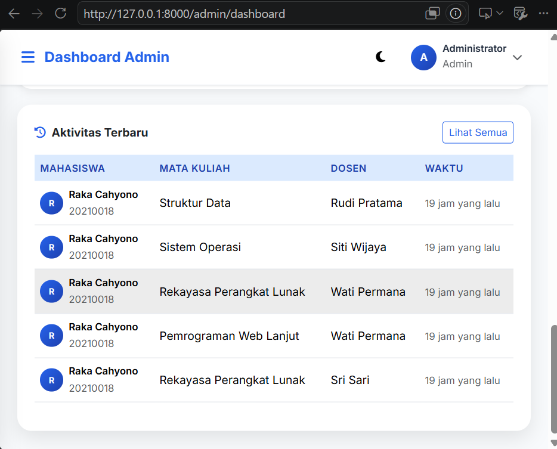
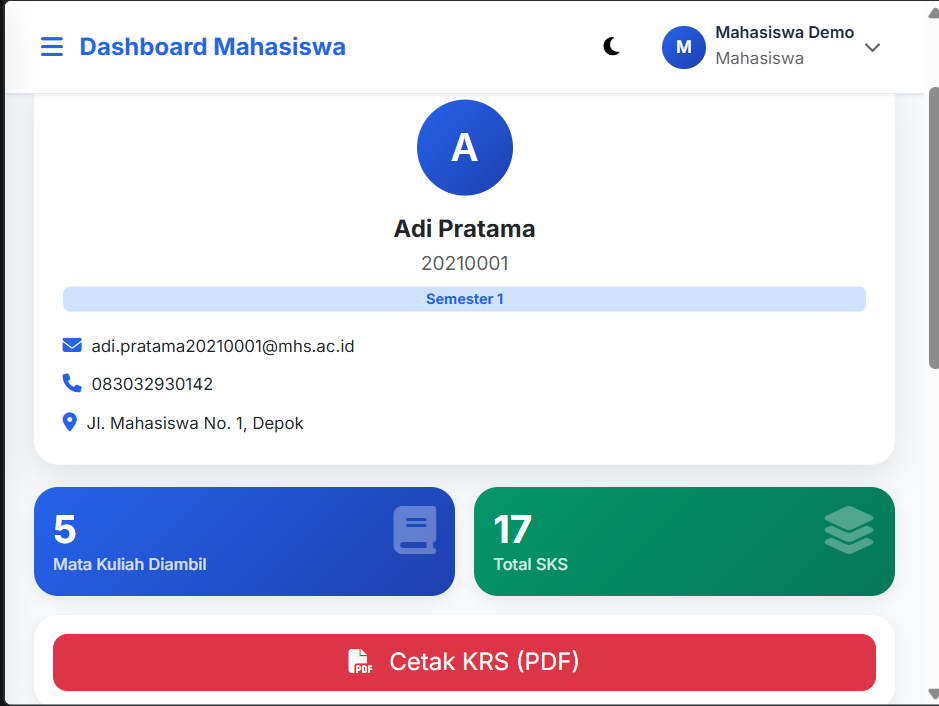
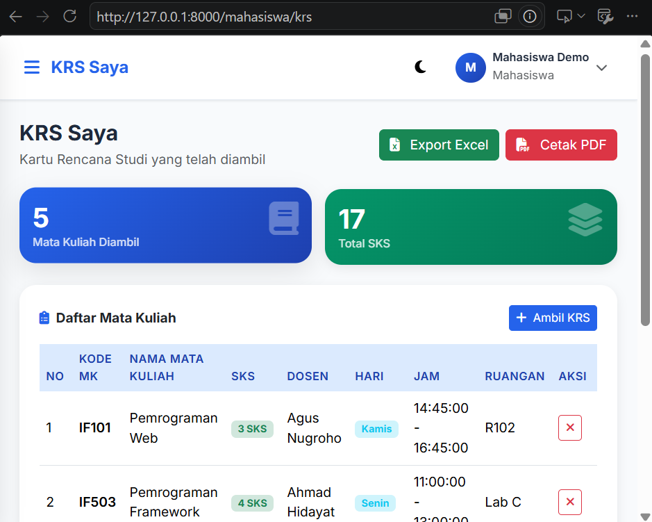
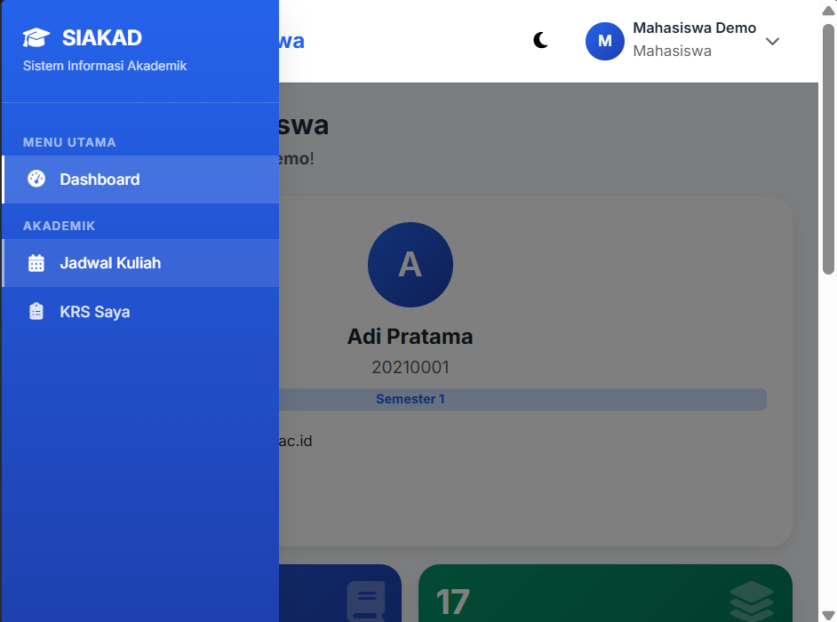
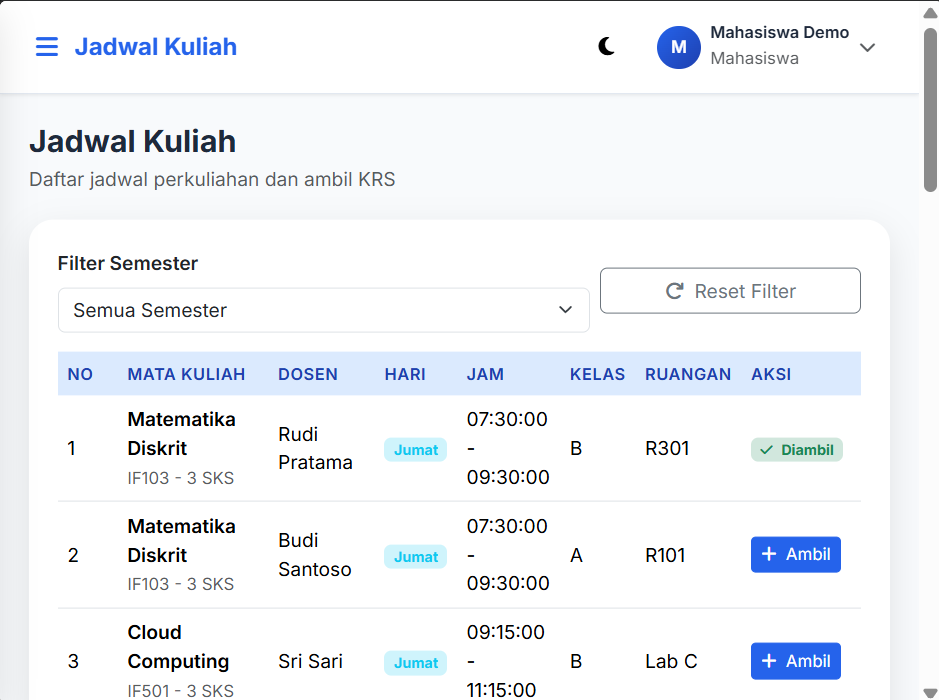

# SIAKAD - Sistem Informasi Akademik

Sistem Informasi Akademik (SIAKAD) berbasis Laravel 12 + MySQL + Bootstrap 5 dengan desain modern, responsive, dan clean menggunakan tema biru-putih.

## Fitur

### Admin
- Dashboard statistik dengan grafik (Chart.js)
- Kelola Data Dosen (CRUD, Search, Pagination)
- Kelola Data Mahasiswa (CRUD, Search, Pagination)
- Kelola Mata Kuliah (CRUD, Search, Pagination)
- Kelola Jadwal (CRUD, Search, Filter Semester)
- Kelola Data KRS (Lihat, Export PDF, Export Excel)

### Mahasiswa
- Dashboard dengan biodata, jadwal hari ini, dan total SKS
- Lihat Jadwal Kuliah (Filter Semester)
- Ambil KRS
- Drop Mata Kuliah
- Lihat KRS yang diambil
- Export KRS ke PDF
- Export KRS ke Excel

## Teknologi

- **Backend:** Laravel 12, PHP 8.2+
- **Database:** MySQL
- **Frontend:** Bootstrap 5, Font Awesome, DataTables, SweetAlert2, Chart.js
- **Auth:** Laravel Breeze (login/logout)
- **Role:** Spatie Laravel Permission
- **Export:** Barryvdh DomPDF (PDF), Maatwebsite Excel (Excel)

## Instalasi

1. **Clone / download project**
   ```bash
   cd siakad
   ```

2. **Install dependencies**
   ```bash
   composer install
   npm install
   npm run build
   ```

3. **Konfigurasi database**
   - Buat database MySQL dengan nama `siakad`
   - Sesuaikan konfigurasi di file `.env`:
     ```
     DB_DATABASE=siakad
     DB_USERNAME=root
     DB_PASSWORD=
     ```

4. **Generate key & jalankan migrasi**
   ```bash
   php artisan key:generate
   php artisan migrate --seed
   ```

5. **Jalankan server**
   ```bash
   php artisan serve
   ```

6. **Akses aplikasi**
   Buka browser: `http://localhost:8000`

## Akun Demo

| Role      | Email                | Password   |
|-----------|----------------------|------------|
| Admin     | admin@gmail.com      | password   |
| Mahasiswa | mahasiswa@gmail.com  | password   |

## Struktur Folder

```
app/
├── Http/
│   ├── Controllers/
│   │   ├── Admin/          (Dashboard, Dosen, Mahasiswa, MataKuliah, Jadwal, Krs)
│   │   ├── Auth/           (AuthenticatedSessionController)
│   │   └── Mahasiswa/      (Dashboard, Jadwal, Krs)
│   ├── Middleware/         (CheckRole)
│   └── Requests/           (Dosen, Mahasiswa, MataKuliah, Jadwal + Auth/Login)
├── Models/                 (User, Dosen, Mahasiswa, MataKuliah, Jadwal, Krs)
├── Exports/                (KrsExport, KrsMahasiswaExport)
database/
├── migrations/             (users, dosen, mahasiswa, mata_kuliah, jadwal, krs)
└── seeders/                (Database, Role, User, Dosen, MataKuliah, Mahasiswa, Jadwal, Krs)
resources/views/
├── admin/                  (dashboard, dosen, mahasiswa, mata-kuliah, jadwal, krs)
├── auth/                   (login)
├── layouts/                (app)
└── mahasiswa/              (dashboard, jadwal, krs)
```

## Database Schema

### Tabel Users
- id, name, email, password, role, timestamps

### Tabel Dosen
- id, nidn, nama_dosen, email, no_hp, alamat, timestamps

### Tabel Mahasiswa
- id, nim, nama_mahasiswa, email, no_hp, alamat, semester, user_id, timestamps

### Tabel Mata Kuliah
- id, kode_mk, nama_mk, sks, semester, timestamps

### Tabel Jadwal
- id, mata_kuliah_id, dosen_id, hari, jam_mulai, jam_selesai, kelas, ruangan, timestamps

### Tabel KRS
- id, mahasiswa_id, jadwal_id, timestamps

## Relationships

- Mahasiswa belongsTo User
- Jadwal belongsTo Dosen
- Jadwal belongsTo MataKuliah
- Mahasiswa hasMany KRS
- KRS belongsTo Mahasiswa
- KRS belongsTo Jadwal
- MataKuliah hasMany Jadwal
- Dosen hasMany Jadwal

## Data Seeder

- 10 Dosen
- 50 Mahasiswa
- 20 Mata Kuliah
- 30 Jadwal
- KRS random untuk setiap mahasiswa

## Screanshoot

### Login


### Admin




### Mahasiswa





## Lisensi

MIT
